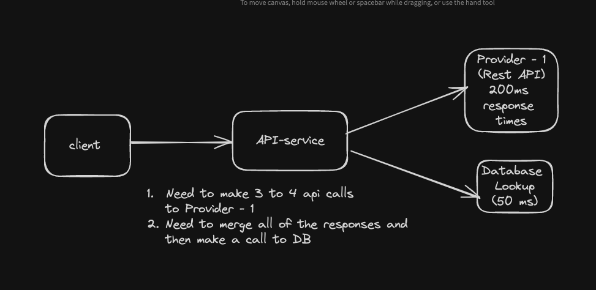

# Different Implementation Strategies for Multiplexing HTTP Requests in Spring Boot

## Overview

This document presents the architecture of an API service. The service is designed to execute multiple calls to a Provider API, consolidate the results, and perform a database lookup. The project showcases three distinct implementations:

- Regular Spring Boot with `RestClient`.
- Spring Boot with virtual threads.
- Spring WebFlux.

## Regular Spring Boot Implementation (`http-multiplexing-regular`)

In this module, we use Spring MVC with a `ThreadPoolTaskExecutor` for making concurrent API calls using `RestClient`.

### Key Components

- `RestTemplate` for synchronous HTTP requests.
- `ThreadPoolTaskExecutor` configured for optimal resource utilization and throughput.

## Spring Boot with Virtual Threads (`http-multiplexing-virtual-threads`)

This approach uses the cutting-edge virtual threads feature from Java 21 to manage concurrent API calls with an `ExecutorService`.

### Key Components

- Java 21's virtual threads for lightweight concurrency.
- `CompletableFuture` for asynchronous operation and thread management.
- Synchronous HTTP requests made with the new `RestClient`.

## Spring WebFlux Implementation (`http-multiplexing-reactive`)

The reactive implementation uses Spring WebFlux for non-blocking I/O operations, making it suitable for high-load scenarios.

### Key Components

- `WebClient` for reactive HTTP requests.
- Reactor's `Mono` and `Flux` types for asynchronous stream processing.
- Built-in backpressure management for resource efficiency.

## Performance Testing (`performance-test`)

This module contains performance tests and benchmarks for each implementation. It measures response times, throughput, and system resource utilization.

## Provider API (`provider-api`)

A mock Provider API simulates the external service, allowing us to test our implementations in a controlled environment.

### Key Components

- Spring Boot application with endpoints that simulate data retrieval.
- Controlled response times to mimic real-world API behavior.

## Running the Project
- docker-compose up